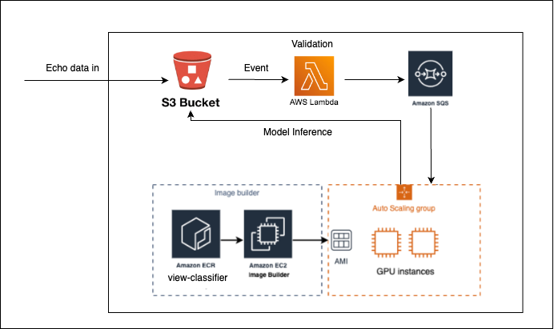

# L3-net Web Application
Echo Cloud is an automated application for the storage and processing of echocardiogram videos. When new data is passed to the application, it is passed to the deployed model (at this time the view-classifier) and the resulting output is securely stored. Substituting the deployed model can be done by following the deployment guide.

## Stack

* **Data** - All data is saved in Amazon S3 
* **Model** - The models were containerized and deployed to Amazon ECR public repositories. 
* **Image** - As part of the infrastructure build, a custom AMI is created with model deployed in it to improve efficiency. 
* **Model Processing** - In the back-end, it was essential to create a cost-effective solution as it uses GPU machines to run the model. It is inspired by an [AWS blog post](https://aws.amazon.com/blogs/compute/running-cost-effective-queue-workers-with-amazon-sqs-and-amazon-ec2-spot-instances/), which describes how to dynamically run EC2 Spot instances in response to the SQS messages, pulling the model docker image from Amazon Elastic Container Repository.
* **Model Visualization** - Javascript plug-in displays the CT Scan image slices with the model results overlaid on top. 

## High level architecture

# Deployment
To deploy this solution into your AWS Account please follow our [Deployment Guide](./docs/deployment_guide.md)

# Authors
The key contributors to this repository are Artur Rodrigues a Senior Solutions Architect from the AWS, Tim Esler and Brian Lee of Sapien ML.

# Changelog
* Jul 13, 2020: Initial release.

# License
This project is distributed under the  [Apache License 2.0](https://github.com/UBC-CIC/vgh-covid-19-ct-model/blob/master/LICENSE) 

